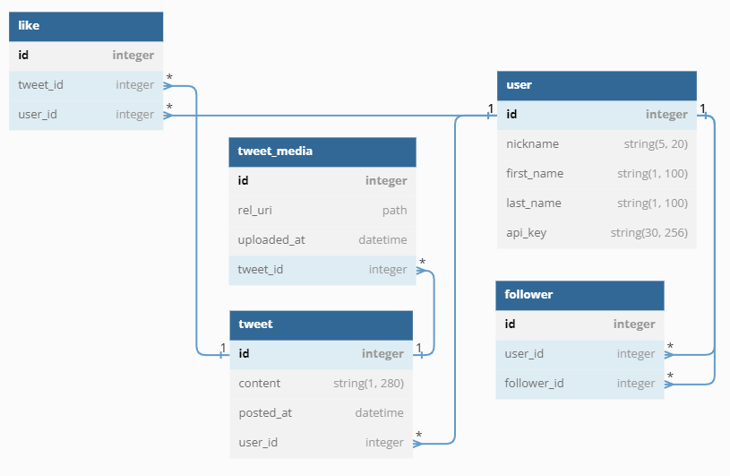

# Финальная работа курса "Python Advanced". Корпоративный сервис микроблогов

[](https://gitlab.skillbox.ru/vladimir_saltykov/python_advanced_diploma/-/pipelines)

## Задача
Для корпоративного сервиса микроблогов необходимо реализовать бэкенд приложения. Поскольку это корпоративная сеть, то функционал будет урезан относительно оригинала.

Более подробно задача и требуемый функционал описаны в [ТЗ](docs/tt/technical_task.pdf).

### Функциональные требования:
* Пользователь может добавить новый твит.
* Пользователь может удалить свой твит.
* Пользователь может зафоловить другого пользователя.
* Пользователь может отписаться от другого пользователя.
* Пользователь может отмечать твит как понравившийся.
* Пользователь может убрать отметку «Нравится».
* Пользователь может получить ленту из твитов отсортированных в порядке убывания по популярности от пользователей, которых он фоловит.
* Твит может содержать картинку.

### Нефункциональные требования:
* Систему должно быть просто развернуть. Например, через Docker Compose.
* Система не должна терять данные пользователя между запусками.
* Все ответы сервиса должны быть задокументированы через Swagger.
* Документация должна быть доступна в момент запуска приложения.

## Стэк
* Python >= 3.9
* FastAPI
* SQLAlchemy
* PostgreSQL
* Docker

## Запуск окружения разработки
1. Поднять ВМ (на ВМ будут установлены ansible, docker и docker-compose)
   ```shell
   # On Linux
   make vm-up-provision
   
   # On Windows
   vagrant up --provision
   ```

2. Подключиться к ВМ
   ```shell
   # On Linux
   make vm-connect
   
   # On Windows
   vagrant ssh
   ```
   
3. В терминале ВМ перейти в директорию с проектом
   ```shell
   cd /vagrant
   ```
   
3. Поднять контейнеры для разработки
   ```shell
   make up
   ```
   
## Миграции
```shell
make migrate
```
   
## Тестирование
```shell
make test
```

## Структура БД



Структура спроектирована в [dbdiagram.io](https://dbdiagram.io/d/644b964bdca9fb07c433064b).

## Полезные материалы
* [SQLAlchemy: relationship для асинхронного подключения, способ 1](https://stackoverflow.com/a/70105356)
* [SQLAlchemy: relationship для асинхронного подключения, способ 2](https://stackoverflow.com/a/75947988)
* [SQLAlchemy: множественные ForeignKey на одно и то же поле](https://stackoverflow.com/a/22357235)
* [FastAPI: Переопределение имен полей в респонсе](https://stackoverflow.com/a/60211253)
* [FastAPI: Авторизация с APIKey, пример 1](https://itsjoshcampos.codes/fast-api-api-key-authorization)
* [FastAPI: Авторизация с APIKey, пример 2](https://nilsdebruin.medium.com/fastapi-authentication-revisited-enabling-api-key-authentication-122dc5975680)
