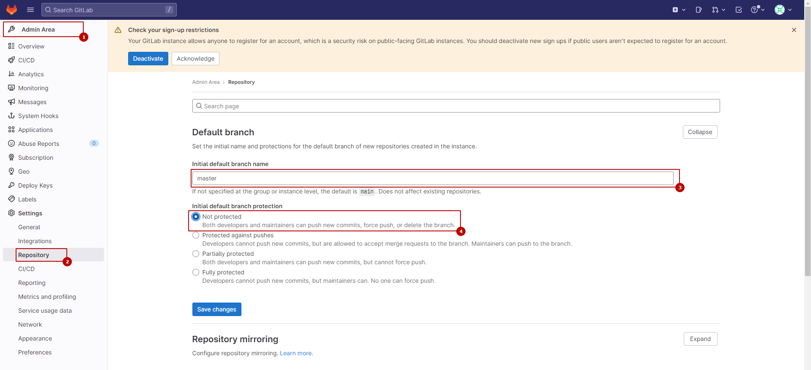
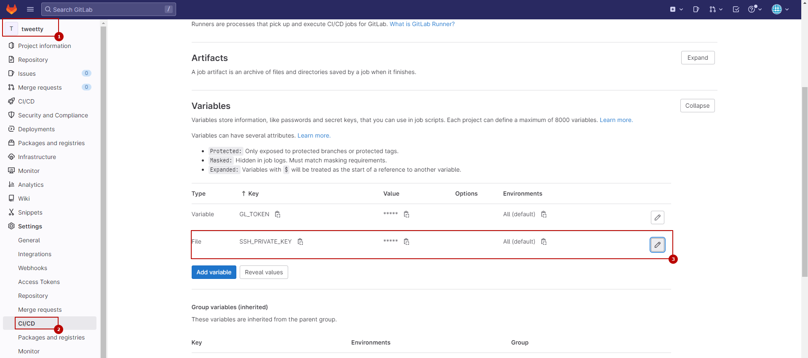

# Финальная работа курса "Python Advanced". Корпоративный сервис микроблогов

[](https://gitlab.skillbox.ru/vladimir_saltykov/python_advanced_diploma/-/pipelines)

## Задача
Для корпоративного сервиса микроблогов необходимо реализовать бэкенд приложения. Поскольку это корпоративная сеть, то функционал будет урезан относительно оригинала.

Более подробно задача и требуемый функционал описаны в [ТЗ](docs/tt/technical_task.pdf).

### Функциональные требования:
* Пользователь может добавить новый твит.
* Пользователь может удалить свой твит.
* Пользователь может зафоловить другого пользователя.
* Пользователь может отписаться от другого пользователя.
* Пользователь может отмечать твит как понравившийся.
* Пользователь может убрать отметку «Нравится».
* Пользователь может получить ленту из твитов отсортированных в порядке убывания по популярности от пользователей, которых он фоловит.
* Твит может содержать картинку.

### Нефункциональные требования:
* Систему должно быть просто развернуть. Например, через Docker Compose.
* Система не должна терять данные пользователя между запусками.
* Все ответы сервиса должны быть задокументированы через Swagger.
* Документация должна быть доступна в момент запуска приложения.

## Стэк
* Python >= 3.9
* FastAPI
* SQLAlchemy
* Alembic
* PostgreSQL
* Docker

## Запуск окружения разработки
1. Поднять ВМ (на ВМ будут установлены ansible, docker и docker-compose)
   ```shell
   # On Linux
   make vm-up-provision NAME=dev

   # On Windows
   vagrant up dev --provision
   ```

1. Подключиться к ВМ
   ```shell
   # On Linux
   make vm-connect NAME=dev

   # On Windows
   vagrant ssh dev
   ```

1. В терминале ВМ перейти в директорию с проектом
   ```shell
   cd /vagrant
   ```

1. Поднять контейнеры для разработки
   ```shell
   make up
   ```

## Документация Swagger
При работе через VM Vagrant документация доступна Swagger доступна по адресу [http://192.168.1.33:5000/docs](http://192.168.1.33:5000/docs).

## Миграции
```shell
make migrate
```

## Тестирование
```shell
make lint
```

```shell
make test
```

## Структура БД


Структура спроектирована в [dbdiagram.io](https://dbdiagram.io/d/644b964bdca9fb07c433064b).

## Демо-стенд
Для демонстрации и проработки полного цикла CI/CD можно развернуть демо-стенд, основанный на виртуальных машинах Vagrant. Конфигурация ВМ описана в [Vagrantfile](Vagrantfile). Виртуальные машины разворачиваются и настраиваются автоматически, но может потребоваться небольшая ручная конфигурация, описанная ниже.

### Запуск и настройка демо-стенда
1. Поднять демо-стенд. Автоматическое настраивание виртуальных машин займет где-то 15-20 минут.
   ```shell
   vagrant up
   ```

1. Перейти в GitLab [http://192.168.1.34/](http://192.168.1.34/) и зарегистрировать нового пользователя

1. Узнать пароль пользователя `root` от GitLab
   ```shell
   vagrant ssh gitlab -c "docker exec gitlab grep 'Password:' /etc/gitlab/initial_root_password"
   ```

1. [Одобрить регистрацию нового пользователя](http://192.168.1.34/admin/users?filter=blocked_pending_approval) из под пользователя `root`

1. Сделать дефолтной веткой ветку `master`. Ветка `master` нужна, потому что автоматическое версионирование настроено на эту ветку.

   

1. Войти под созданным ранее пользователем и создать новую публичную группу `python_advanced_diploma` и новый публичный проект `tweetty` в созданной группе. На самом деле имена группы и проекта не важны, но с целью упрощения последующих команд в них используются именно эти имена.

1. Зарегистрировать новый Gitlab Runner
   ```shell
   vagrant ssh gitlab -c "docker run --rm -it -v /srv/gitlab-runner/config:/etc/gitlab-runner gitlab/gitlab-runner register"
   ```

   

1. Создать Access Token в проекте `tweetty`. После создания токена нужно скопировать его, потому что он потребуется на следующем шаге

   

1. Создать переменную `GL_TOKEN` в переменных CI/CD и указать в качестве значения токен с предыдущего шага. Эта переменная нужна для [автоматического создания релизов](https://python-semantic-release.readthedocs.io/en/latest/#releasing-on-github-gitlab)

   

1. Получить публичный ключ dokku для деплоя из гит-репозитория
   ```shell
   vagrant ssh backend -c "dokku git:public-key"
   ```

1. Добавить полученный на предыдущем шаге ключ в GitLab

   

1. После всех настроек должна появиться возможность синхронизации с гит-репозиторием. Следующей командой можно проверить доступность ВМ `gitlab` через платформу Dokku, которая настроена на ВМ `backend`
   ```shell
   vagrant ssh backend -c "dokku git:sync tweetty git@192.168.1.34:python_advanced_diploma/tweetty.git master"
   ```

   В результате должны увидеть на консоли что-то похожее
   ```shell
   -----> Cloning tweetty from git@192.168.1.34:python_advanced_diploma/tweetty.git#
          Detected branch, setting deploy-branch to master
   ```

### Настройка деплоя из GitLab через SSH
Подробно требования по настройке описана в [документации GitLab](https://docs.gitlab.com/ee/ci/ssh_keys/#how-it-works).

1. Получить содержимое приватного ключа, сгенерированного на ВМ `gitlab`
   ```shell
   vagrant ssh gitlab -c "cat /home/vagrant/.ssh/gitlab_id_ed25519"
   ```

1. Создать переменную `SSH_PRIVATE_KEY` с типом `File` в проекте `tweetty` и поместить в нее содержимое приватного ключа, полученное на предыдущем шаге.

   

   **Очень важно, чтобы значение переменной содержало в конце одну пустую строку**

   

1. Получить значение публичного ключа, сгенерированного на ВМ `gitlab`
   ```shell
   vagrant ssh gitlab -c "cat /home/vagrant/.ssh/gitlab_id_ed25519.pub"
   ```

1. Добавить публичный ключ в список авторизованных на ВМ `backend`
   ```shell
   vagrant ssh backend -c "echo 'ssh-ed25519 AAAAC3NzaC1lZDI1NTE5AAAAIMPENs+2RCvgZiTbH43jgD3RNIgYLDudV25yiJx1UFih gitlab_key' | sudo tee --append /home/dokku/.ssh/authorized_keys"
   ```

### Публикация изменений в репозиторий демо-стенда
1. Добавить новый remote в свой гит
   ```shell
   git remote add demo http://192.168.1.34/python_advanced_diploma/tweetty.git
   ```

1. Пушить в GitLab демо-стенда можно командой
   ```shell
   git push -u --tags demo <local_branch>:<remote_branch>
   ```

## Полезные материалы
* [Коды статусов HTTP](https://ru.wikipedia.org/wiki/%D0%A1%D0%BF%D0%B8%D1%81%D0%BE%D0%BA_%D0%BA%D0%BE%D0%B4%D0%BE%D0%B2_%D1%81%D0%BE%D1%81%D1%82%D0%BE%D1%8F%D0%BD%D0%B8%D1%8F_HTTP)
* [pyproject.toml](https://python-poetry.org/docs/pyproject/)
* [CI: Python Semantic Release](https://python-semantic-release.readthedocs.io/en/latest/)
* [CI: Python Semantic Release example](https://guicommits.com/semantic-release-to-automate-versioning-and-publishing-to-pypi-with-github-actions/)
* [Angular commit message styleguide](https://github.com/angular/angular.js/blob/master/DEVELOPERS.md#commits)
* [SQLAlchemy: relationship для асинхронного подключения, способ 1](https://stackoverflow.com/a/70105356)
* [SQLAlchemy: relationship для асинхронного подключения, способ 2](https://stackoverflow.com/a/75947988)
* [SQLAlchemy: множественные ForeignKey на одно и то же поле](https://stackoverflow.com/a/22357235)
* [FastAPI: Переопределение имен полей в респонсе](https://stackoverflow.com/a/60211253)
* [FastAPI: Авторизация с APIKey, пример 1](https://itsjoshcampos.codes/fast-api-api-key-authorization)
* [FastAPI: Авторизация с APIKey, пример 2](https://nilsdebruin.medium.com/fastapi-authentication-revisited-enabling-api-key-authentication-122dc5975680)
* [FastAPI: Передача файлов в запросе](https://fastapi.tiangolo.com/tutorial/request-files/)
* [FastAPI: Как ограничить размер загружаемого файла](https://stackoverflow.com/questions/72338900/how-to-limit-python-fastapi-post-request-upload-file-size)
* [FastAPI: Параметризация зависимостей](https://fastapi.tiangolo.com/advanced/advanced-dependencies/)
* [FastAPI: Обработка ошибок](https://fastapi.tiangolo.com/tutorial/handling-errors/)
* [HTTPX: Передача файлов в запросе AsyncClient](https://stackoverflow.com/a/72104365)
* [Pytest: Использование фикстур из различных модулей](https://gist.github.com/peterhurford/09f7dcda0ab04b95c026c60fa49c2a68)
* [GitLab: Установка GitLab из docker-образа](https://docs.gitlab.com/ee/install/docker.html#install-gitlab-using-docker-engine)
* [GitLab: Установка gitlab-runner](https://docs.gitlab.com/16.0/runner/install/docker.html#option-1-use-local-system-volume-mounts-to-start-the-runner-container)
* [GitLab: Использование SSH-ключей в CI/CD](https://docs.gitlab.com/ee/ci/ssh_keys/#how-it-works)
* [Dokku: Установка](https://dokku.com/docs/getting-started/installation/#1-install-dokku)
* [Dokku: Установка из репозитория](https://dokku.com/docs/deployment/methods/git/#initializing-from-private-repositories)
